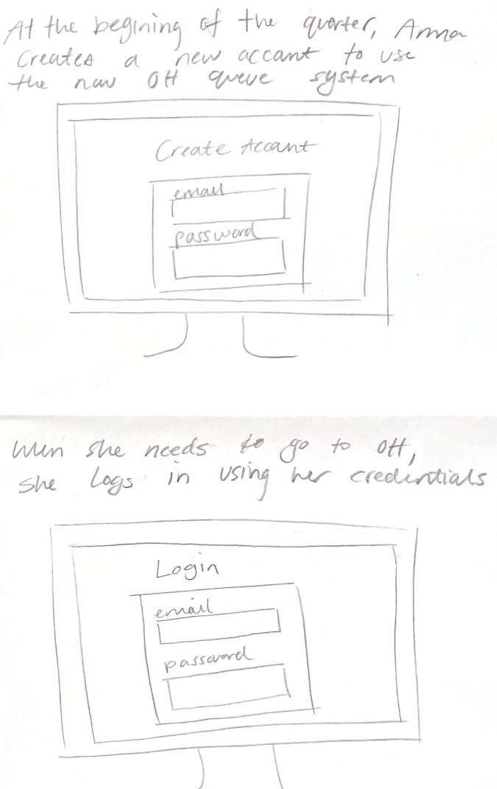
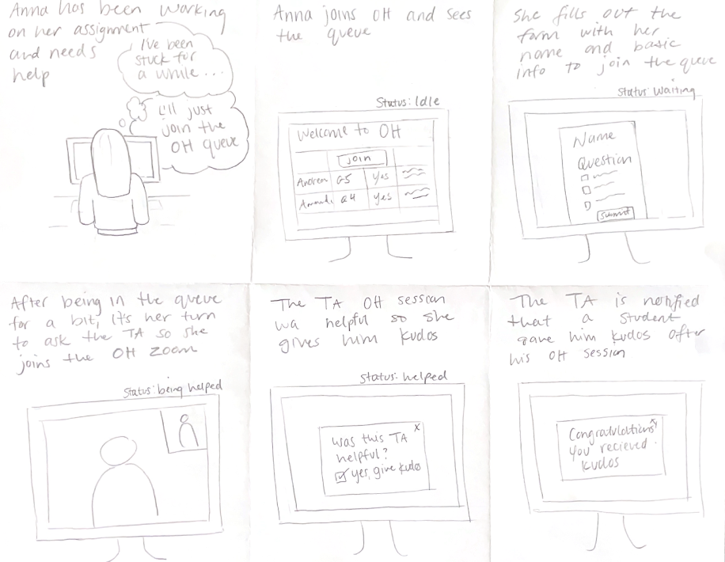
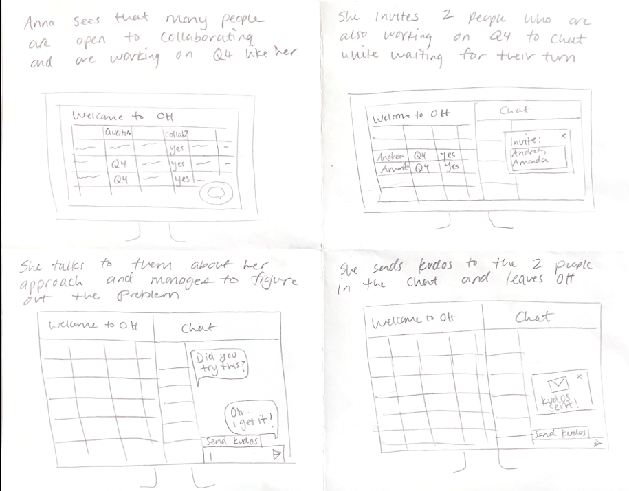
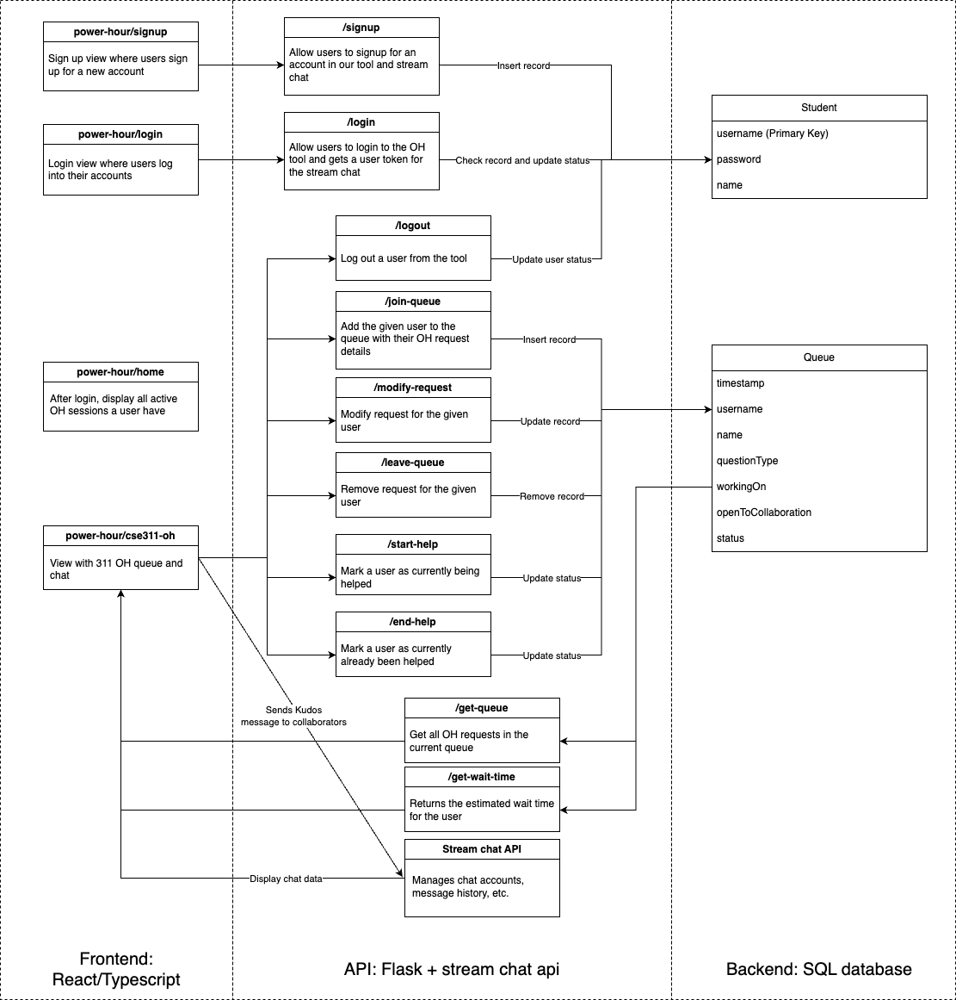

# Code and Design Specification
## Requirements
### Functional requirements
#### Primary
##### Students flow
- Can create accounts and log in
- Can join an existing OH shift
- Can join the queue by filling in a form
- Can view student information currently on the queue
- Can view estimated wait time based on question type
- Can start a collaboration chat session or join an existing session with other students open to collaboration
- Will receive notification if they are next in line to get help
Can leave the queue

#### Secondary
##### TA flow
- Can receive kudos from students
- Can start an OH shift
- Can view student information on the queue
- Can help students on the queue
- Can end OH shift
##### Students
- Can give kudos to TAs and other students

### Technical requirements
#### Primary
- Authentication/account system can handle different student accounts
- Queue system:
  - Handles multiple students joining and leaving, the state of the queue should be synchronized on different app instances
  - Automatically updates student status
  - Displays the information (Timestamp, Name, Question type, Working on…, Status, Location (Zoom or in person), Open to collaboration) of student in the queue in chronological order
  - Calculate and dynamically update estimated wait time for each student once they join the queue based on question type
- Chat system
  - Join/create/leave chat
  - Sending messages
  - Bot reminder on collaboration policy and placement in queue

#### Secondary
- Kudos system
  - Prompt students to give Kudos to a different user (student/TA)
  - Display received Kudos as notifications

### Usability requirements
#### Primary
- The main component of the tool, including joining the queue, and leaving the queue, should be intuitive
- The status of the student in the queue should be intuitive, if not we should provide tooltips with more detailed explanations
- Users can discover how to create a chat and add users to the chat
#### Secondary
- Customizable Kudos message
- TA flow for starting and ending OH shift, and helping a student, should be intuitive

## Storyboards
### Registration flow
- Student registers for an account with their email and password
- Student logs in everytime she wants to enter the queue. Her messages and previous queuing history is stored in this account.

### Normal OH flow
- Student gets stuck on HW and signs into the OH tool
- Student sees a queue interface for the current OH session (Status: Idle)
- Student fills in a help request to join queue (Status: Waiting)
- TA comes over and help the student (Status: Being Helped)
- Student is helped and gets prompted a message to give the TA a kudos if they are helpful (Status: Helped)
- Student gives TA a kudos and walks away satisfied

### Collaboration flow
- Student sees many people open to collaboration on the queue working on similar problem
- Student creates a collaboration session/joins an existing collaboration session with those students
- In the chat, student gets inspiration from a collaborator’s message, and they managed to solve the problem while waiting in queue
- Student gives that collaborator a kudos message and leaves the queue

## Architectural design

This is our total flow for our Office Hours tool with qualitative descriptions of how our components will talk to each other, get user input, and process inputted data.
{: height="159px" width="299px"}

In the figure below, you can see subcomponents of our endpoints for our site navigation and overall flow.

## How our system enables the requirements
All the components we have identified above fits together to create an end-to-end web application. We will focus on the student flow and students can sign up for an account in our tool then sign in to join a particular active OH session hosted by a TA. They can view the current queue and choose to join the queue with their particular request and leave the queue if they decide to, along with seeing their estimated wait time. All OH requests from different students and their account information will be stored in the backend database, and the statuses of the requests would be updated accordingly using the endpoints. The stream chat API enables us to manage a built-in chat application, including functionality like creating a chat with selected users, posting in the chat, and storing and displaying the message history. The chat enables them to reach out to other collaborators or join an existing collaboration session in the current active OH session.